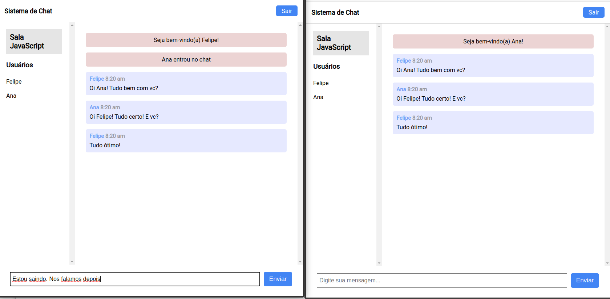

# Sistema de Chat

> Sistema de chat em tempo real desenvolvido em NodeJS e SocketIO.




## Pré-requisitos

Ter instalado o NodeJS e algum navegador como Google Chrome ou Firefox.

## Instalação

```bash
git clone https://github.com/felipesvianna/sistema-de-chat
npm install
```

## Utilização

```bash
npm start
```

## Pacotes NodeJS utilizados

- express
- moment
- socket.io

## Padrões de Desenvolvimento

Contem configurações para o Prettier usando ESLint e Airbnb Javascript Style

### Padrões de Código

- [Airbnb JavaScript Style](https://github.com/airbnb/javascript)
- [ESLint](https://eslint.org/docs/rules/)

### Pacotes de Linting

- eslint
- prettier
- eslint-plugin-prettier
- eslint-config-prettier
- eslint-plugin-node
- eslint-config-node
- eslint-config-airbnb

### Comandos de instalação

- Prettier e ESLint

```
npm i -D eslint prettier eslint-plugin-prettier eslint-config-prettier eslint-plugin-node eslint-config-node
```

- Airbnb Javascript Style

```
npx install-peerdeps --dev eslint-config-airbnb

```
